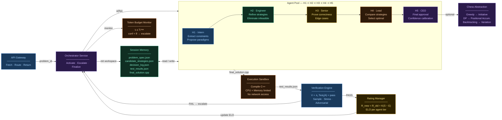

# CodeGrandmaster

**Hierarchical Multi-Agent Architecture for Real-Time Codeforces Problem Solving with Chess-Inspired Strategic Abstraction**

CodeGrandmaster is a hierarchical multi-agent system designed to solve Codeforces problems in real-time while providing structured explanations inspired by chess strategic archetypes. The system integrates role-based agent hierarchy, session-scoped file memory, rating-based governance, and computational cost control. The objective is to improve reasoning robustness, reduce hallucination, and maintain cost efficiency.

Please check out the [System Idea](docs/Idea.tex) for more details.

## System Architecture

The core of CodeGrandmaster is its hierarchical multi-agent architecture, mirroring a corporate structure with specialized roles and a chess-inspired strategic layer.

### System Architecture Diagram

### System Architecture Diagram

_Note: This is a structural overview. For the fully interactive, animated visualization, please open [architecture-diagram.html](https://erebuzzz.github.io/CodeGrandmaster/architecture-diagram.html) in your browser._

### Key Components

1.  **API Gateway**: The entry point that interacts with the Codeforces API to fetch problems, contest lists, and standings. It handles:
    *   `GET problemset.problems`
    *   `GET contest.list`
    *   `GET contest.standings`

2.  **Core Services**:
    *   **Session Memory**: Creates an isolated workspace per problem with append-only JSON logs (problem spec, strategies, decision log, test results). No cross-session leakage ensures purity.
    *   **Orchestrator Service**: The central coordinator that activates agents based on problem rating, manages escalation, and finalizes sessions.
        *   Activation Rules:
            *   Rating < 1200: H1 + H2
            *   1200 - 1800: H1 + H2 + H3
            *   1800 - 2200: H1 + H2 + H3 + H4
            *   Rating ≥ 2200: Full stack H1 → H5
    *   **Token Budget Monitor**: Enforces token caps per role (`tᵢ ≤ Tᵢᵐᵃˣ`) and tracks cost per session.

3.  **Agent Pool (Hierarchy H1 → H5)**:
    *   **H1 Intern Agent (~900 ELO)**: Extracts constraints, proposes paradigms, estimates complexity.
    *   **H2 Engineer Agent (~1500 ELO)**: Refines strategies, eliminates infeasible options, structures algorithms.
    *   **H3 Senior Agent (~1900 ELO)**: Proves correctness, identifies edge cases, optimizes complexity.
    *   **H4 Lead Agent (~2300 ELO)**: Compares strategies, selects optimal trade-offs, validates scalability.
    *   **H5 CEO Agent (~2700 ELO)**: Final approval, confidence calibration, triggers rating updates.

4.  **Execution & Validation**:
    *   **Execution Sandbox**: Isolated container for compiling C++ code. Runs sample + randomized tests and detects TLE/MLE/RTE.
    *   **Verification Engine**: Validates samples, performs stress testing, and generates adversarial edge cases. Failure escalates (max 2 revision cycles).
    *   **Rating Manager**: Manages ELO-style ratings per agent tier. Success rate is tracked by difficulty bucket.

5.  **Abstraction & Deployment**:
    *   **Chess Strategic Abstraction**: Maps algorithm paradigms to chess archetypes for better explanation (e.g., Greedy → Initiative Play, DP → Positional Accumulation).
    *   **Microservice Architecture**: Horizontally scalable, async job queue, load-balanced by problem rating tier.

## Contributing

Contributions are welcome! Please see [CONTRIBUTING.md](CONTRIBUTING.md) for details on how to contribute to this project.

## License

This project is licensed under the MIT License - see the LICENSE file for details.

## Contact

**Erebuzzz** - [kshitiz23kumar@gmail.com](mailto:kshitiz23kumar@gmail.com)

-   **GitHub**: [Erebuzzz](https://github.com/Erebuzzz)
-   **LinkedIn**: [kksinha23](https://linkedin.com/in/kksinha23)
-   **X (Twitter)**: [erebuzzz](https://x.com/erebuzzz)
-   **Discord**: `erebus.0`

Project Link: [https://github.com/Erebuzzz/CodeGrandmaster](https://github.com/Erebuzzz/CodeGrandmaster)
